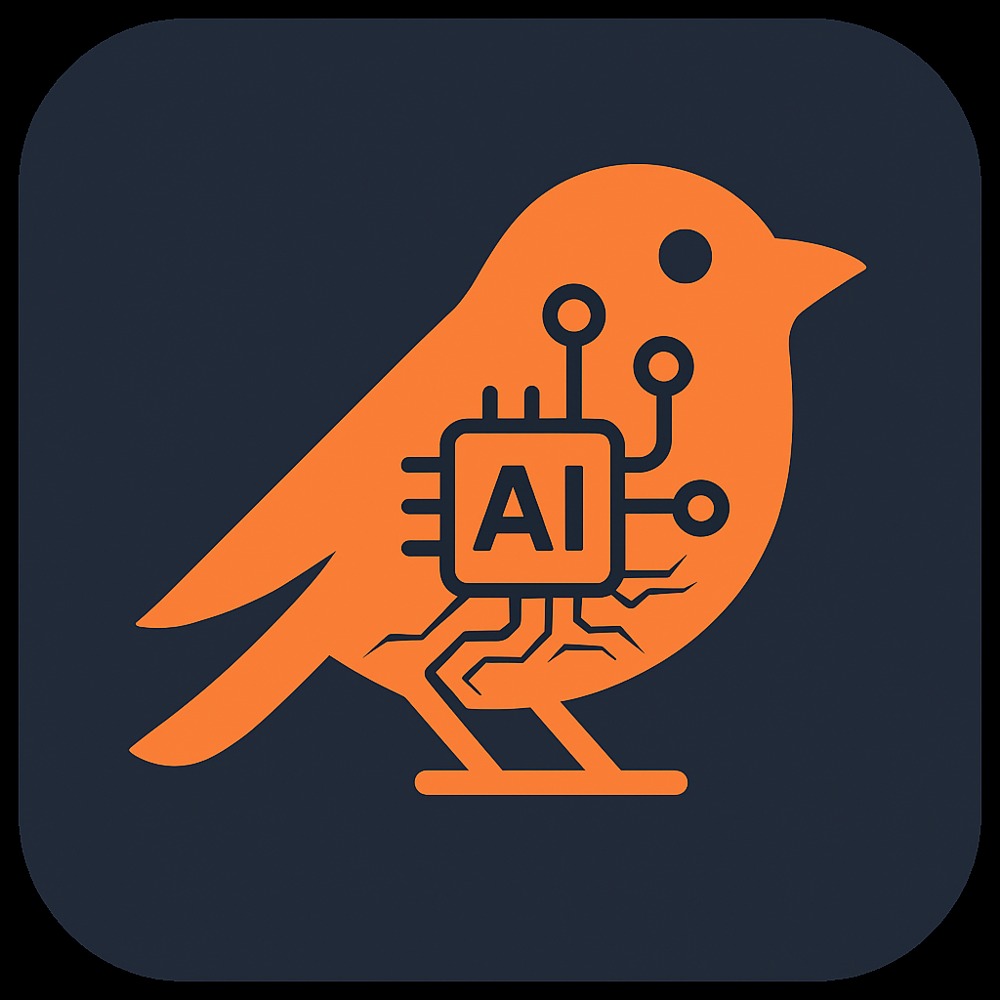

#  onebird-studio


> A minimalist and cross-platform desktop app built with Electron, TypeScript, and Webpack — created by [@onebirdrocks](https://github.com/onebirdrocks)

---

## 🚀 Features

- 🧠 Built with **Electron**
- ✨ Written in **TypeScript**
- ⚙️ Bundled with **Webpack**
- ⚡ Hot-reloading for fast development
- 🖥️ Cross-platform (macOS, Windows, Linux)

---

## 📦 Installation

```bash
# Clone the repo
git clone https://github.com/onebirdrocks/onebird-studio.git
cd onebird-studio
npm install

# Starting your app
npm run dev


